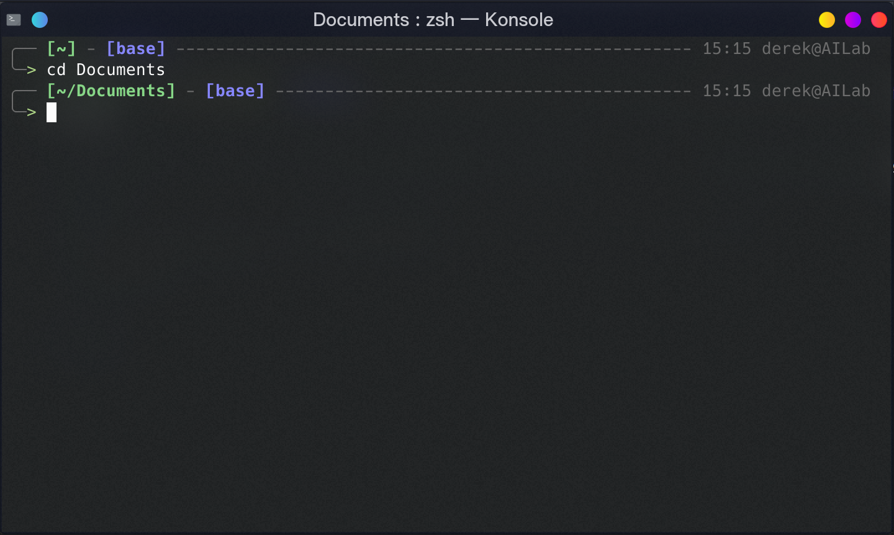
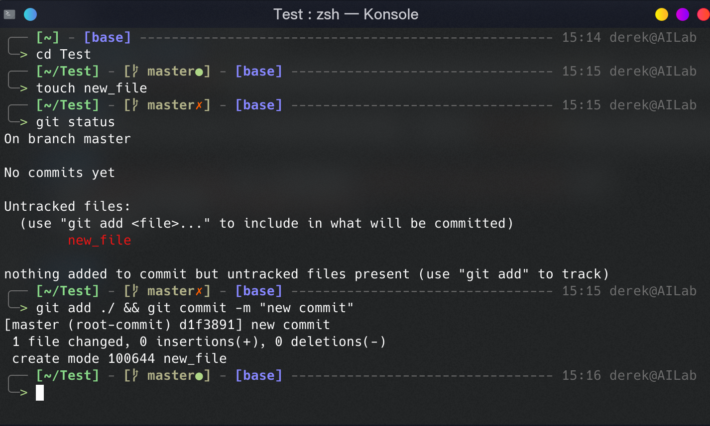
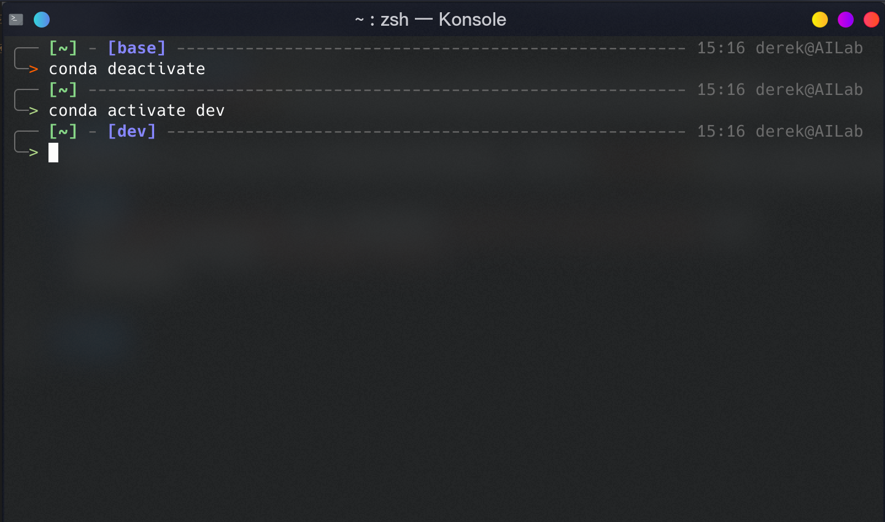

# Zsh Theme: Chainy
在af-magic和[astro主题](https://github.com/iplaces/astro-zsh-theme)的基础上，加入了git和conda信息的multiline zsh theme。

## 兼容性
需要安装powerline-patched 字体才能正常显示部分图标，目前仅在[fira-code](https://github.com/tonsky/FiraCode)上进行过测试。

## 配置
+ 下载`chainy.zsh-theme`文件，并将其复制到`/path/to/.oh_my_zsh/theme`目录下
+ 在`.zshrc`文件中修改`ZSH_THEME="chainy"`
+ 重新加载终端

---
## 截图
+ 默认情况下，该主题会在第一行显示目录、时间、用户名主机名等信息，并在第二行开始接收命令
  

+ 存在git repo时，会显示当前branch和status

+ 对于conda环境，使用绛紫色标识

---
## TODO
+ 增加其他的git信息，例如Head版本号`git_prompt_short_sha`
+ 优化配色方案
