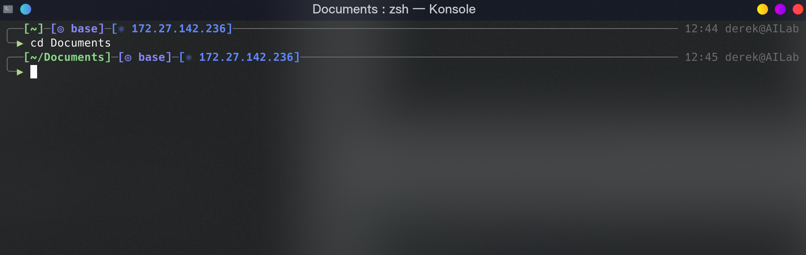

# Zsh Theme: Chainy
在af-magic和[astro主题](https://github.com/iplaces/astro-zsh-theme)的基础上，加入了git和conda信息的multiline zsh theme。

## 特性
+ [x] multiline prompt: 首行由`blocks`构成，显示必要的信息；使用深灰色实线进行分隔
+ [x] 借助`generate_theme.sh`脚本，可自由选择想要显示的信息块并生成对应的`.zsh-theme`文件

## 兼容性
需要安装nerd font字体才能正常显示图标。

## 安装与配置
+ 下载`generate_theme.sh`文件，使用该文件生成`.zsh-theme`。使用方法如下：
  + `-l`选项可显示当前版本的主题支持显示的信息块。
    ```bash
    > zsh generate_theme.sh -l
    script usage:
    This is a generator for chainy-zsh-theme. Specify the blocks you wish to present in PS1, and this script will generate corresponding file.
    Supported blocks are:
    ip     : ip address
    path   : current working directory
    git    : git statues
    conda  : current conda environment
    ```
  + `-d <target_dir>`可指定主题文件的生成目录，默认为当前目录。
  + 在脚本后指定想要加载的信息块，则生成的主题文件中，指定的信息块会按照顺序依次出现在PS1中。
    ```bash
    zsh generate_theme.sh git ip path
    ```
    上面的命令生成的主题文件为
    
+ (如果你实在不想使用上面的脚本，仓库里也有一个我最喜欢的默认主题文件~)
+ 生成主题文件后，移动到`~/.oh-my-zsh/themes/`目录下
```bash
mv chainy.zsh-theme ~/.oh-my-zsh/themes/
```
+ 在`.zshrc`文件中，将`ZSH_THEME`修改为`ZSH_THEME="chainy"`

---
## 截图
+ 默认情况下，该主题会在第一行显示目录、时间、用户名主机名等信息，并在第二行开始接收命令
  


+ 存在git repo/ip/conda环境时，会显示当前branch和status


---
## TODO
+ [ ] 增加其他的git信息，例如Head版本号`git_prompt_short_sha`
+ [ ] 优化配色方案
+ [x] 增加功能选择脚本
